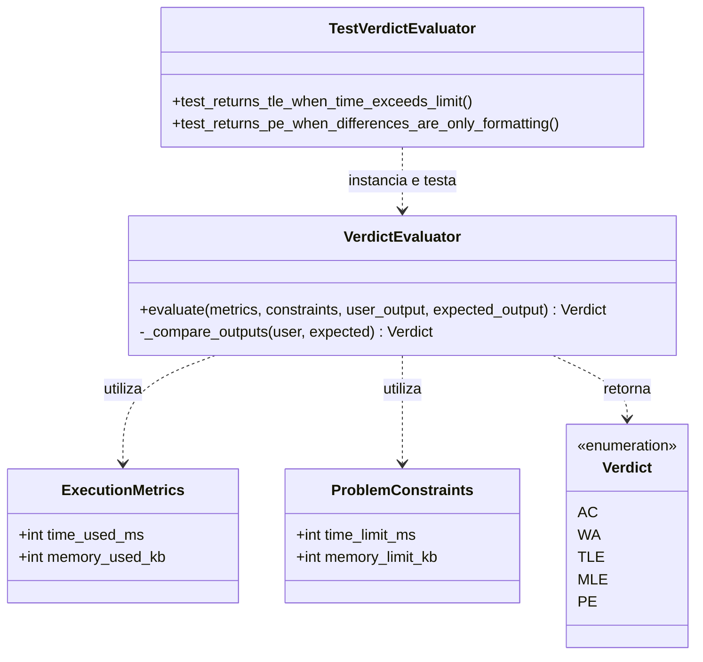

# 01. Testes de Unidade (Unit Testing)

Os testes de unidade garantem a verificação de componentes atômicos do Julgador Automático de forma isolada do restante da infraestrutura (banco de dados, rede e sistema de arquivos).

---

## 1.1 Verificação de lógica atômica na classe `VerdictEvaluator`

### 1. Diagrama de Classes UML

### 2. Explicação Textual do Cenário

* **Contexto:** No desenvolvimento do Julgador Automático, a classe `VerdictEvaluator` é o núcleo de regras de negócio responsável por analisar o resultado de uma submissão e definir o veredito final (ex: `Accepted`, `Time Limit Exceeded`). Por ser uma peça central, seu funcionamento deve ser testado de forma pura e sem dependências externas.

* **Como a abordagem é aplicada:**
  * **Isolamento de I/O:** A classe de teste `TestVerdictEvaluator` substitui a leitura de arquivos físicos em disco por streams em memória utilizando `io.StringIO`.
  * **Injeção de Métricas:** O teste instancia diretamente o `VerdictEvaluator` e chama o método `evaluate()`, passando objetos imutáveis como `ExecutionMetrics` e `ProblemConstraints`.
  * **Asserções Determinísticas:** Testes como `test_returns_tle_when_time_exceeds_limit()` validam se o método privado `_compare_outputs()` e o fluxo principal retornam o enum `Verdict` correto para cada caso de borda em milissegundos.

* **Objetivo do Teste e Defeitos Revelados:**
  * **Precedência de Vereditos:** Garante que estouros de limite físico (tempo/memória) sejam retornados antes de gastar processamento comparando a saída textual.
  * **Incompatibilidades de Formatação:** Valida se diferenças sutis como quebras de linha (`\r\n` vs `\n`) ou espaços no final do arquivo resultam em `PE (Presentation Error)` ou `AC` em vez de falhar erroneamente com `WA (Wrong Answer)`.
  * **Tratamento de Buffers Vazios:** Detecta se a leitura de saídas vazias lança exceções não tratadas (como `IndexError` ou `EOFError`).
