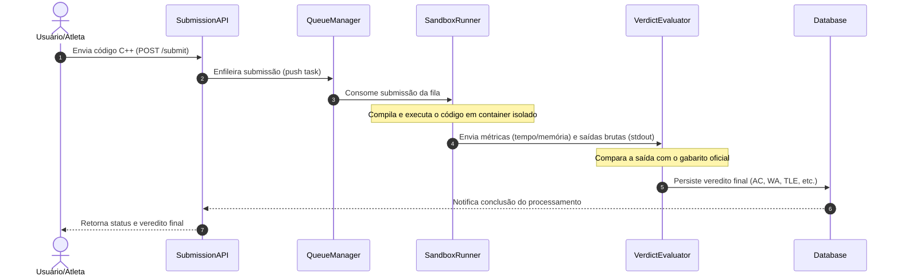
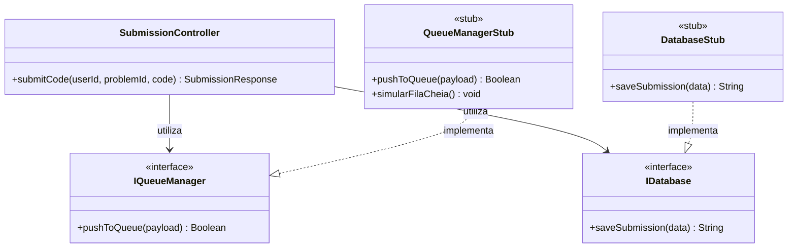
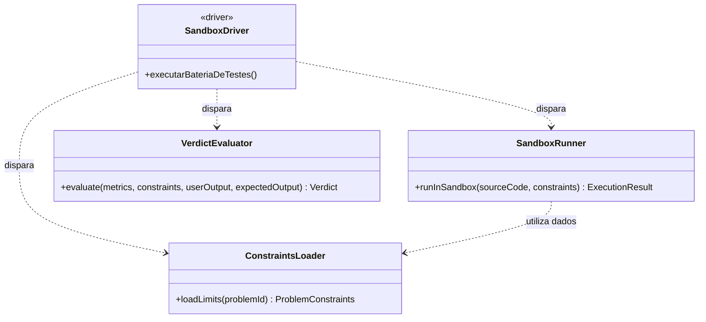
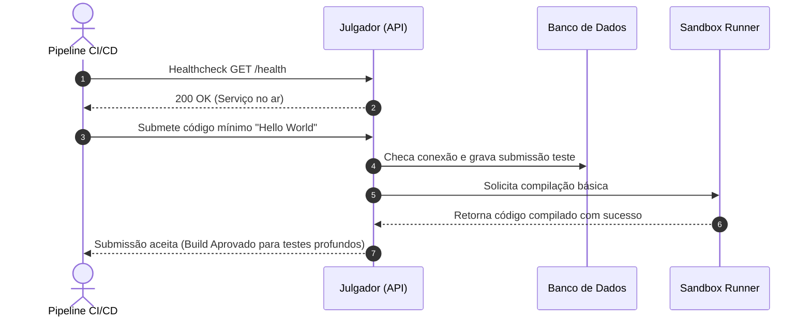
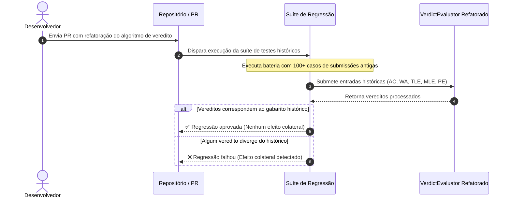

# 02. Testes de Integração (Integration Testing)

Os testes de integração verificam a comunicação e o fluxo de dados entre os diferentes módulos do Julgador Automático.

---

## 2.1 Integração Não Incremental (Big Bang)

### 1. Diagrama de Sequência UML

* **Contexto:** Na abordagem Big Bang, todos os subsistemas do Julgador Automático (`SubmissionAPI`, `QueueManager`, `SandboxRunner`, `VerdictEvaluator` e `Database`) são acoplados e testados simultaneamente de ponta a ponta, sem a criação prévia de *stubs* ou *drivers* para isolamento.

* **Como a abordagem é aplicada:**
  * Uma requisição HTTP simulando o envio de um arquivo C++ é disparada na `SubmissionAPI`.
  * A API repassa a tarefa diretamente para o `QueueManager`, que avisa o `SandboxRunner`.
  * O `SandboxRunner` executa o binário em ambiente isolado e envia as métricas de tempo/memória junto ao `stdout` para o `VerdictEvaluator`.
  * O resultado é gravado no `Database` e retornado ao usuário.

* **Objetivo do Teste e Defeitos Revelados:**
  * **Objetivo:** Validar o fluxo completo da aplicação em um único ciclo e verificar a aderência dos módulos aos contratos de interface.
  * **Incompatibilidades de Payload/Tipagem:** Detecta divergências de formato de dados trafegados entre serviços (ex: IDs passados como `string` pela API e esperados como `integer` pela fila).
  * **Dessincronização de Timeouts:** Revela se o tempo de resposta e retenção da mensagem no `QueueManager` é incompatível com o tempo de compilação/execução no `SandboxRunner`.
  * **Dificuldade de Isolamento:** Demonstra a principal limitação da abordagem: caso ocorra um erro genérico durante o teste, é complexo rastrear se a falha se deu no transporte de dados, na execução do sandbox ou no banco de dados.

## 2.2 Integração Incremental Top-Down (Descendente) com uso de Stubs

### 1. Diagrama de Classes UML

### 2. Explicação Textual do Cenário

* **Contexto:** Na abordagem Top-Down, a verificação começa no componente de mais alto nível da hierarquia (`SubmissionController`), que gerencia o recebimento de códigos C++. Como os serviços de fila e banco de dados podem estar indisponíveis ou em desenvolvimento, utilizamos *Stubs* para simular o comportamento dessas camadas inferiores.

* **Como a abordagem é aplicada:**
  * O controlador `SubmissionController` é instanciado em ambiente de teste real.
  * Injetam-se as instâncias de `QueueManagerStub` e `DatabaseStub` no construtor do controlador através de suas interfaces (`IQueueManager` e `IDatabase`).
  * O teste dispara chamadas para `submitCode()` e os *Stubs* retornam respostas pré-programadas em memória (ex: status de enfileiramento positivo e IDs de submissão sintéticos), permitindo exercitar a lógica do controlador sem dependências externas.

* **Objetivo do Teste e Defeitos Revelados:**
  * **Objetivo:** Garantir que o fluxo de decisão e roteamento da camada superior funcione perfeitamente antes do desenvolvimento completo da infraestrutura de baixo nível.
  * **Falhas no Tratamento de Erros da API:** Permite testar como o controlador reage quando dependências inferiores falham (ex: configurando `simularFilaCheia()` no *Stub* para garantir que a API retorne código HTTP 503 adequadamente).
  * **Incompatibilidade de Contrato de Interface:** Revela se os métodos chamados pelo controlador divergem das assinaturas definidas nas interfaces das dependências.
 
## 2.3 Integração Incremental Bottom-Up (Ascendente) com uso de Drivers

### 1. Diagrama de Classes UML

### 2. Explicação Textual do Cenário

* **Contexto:** Na abordagem Bottom-Up, a integração é realizada a partir dos módulos atômicos situados na base da hierarquia (`ConstraintsLoader`, `SandboxRunner` e `VerdictEvaluator`). Como a camada superior de controle (API) ainda não está integrada, projeta-se um *Driver de Teste* (`SandboxDriver`) para simular chamadas de alto nível e exercitar o comportamento desses serviços inferiores combinados.

* **Como a abordagem é aplicada:**
  * O *Driver* `SandboxDriver` é executado como uma suíte automatizada que simula a chegada de um código em C++.
  * Ele invoca o `ConstraintsLoader` para carregar as restrições de tempo/memória do problema do disco, repassa esses dados para o `SandboxRunner` executar a compilação e isolamento do binário, e envia os artefatos resultantes para validação no `VerdictEvaluator`.
  * O *Driver* captura a saída final para verificar se os módulos da base cooperam corretamente entre si antes da existência de uma interface web ou fila.

* **Objetivo do Teste e Defeitos Revelados:**
  * **Objetivo:** Garantir que a camada crítica de execução e avaliação atômica processe submissões sem erros de comunicação interna antes da criação da camada controladora.
  * **Vazamento e Incompatibilidade de Streams:** Revela se a estrutura do objeto `ExecutionResult` retornado pelo `SandboxRunner` entrega o fluxo de `stdout` em formato compatível com a leitura esperada pelo `VerdictEvaluator`.
  * **Tratamento Incorreto de Limites Operacionais:** Permite identificar se exceções lançadas pelo `ConstraintsLoader` (ex: arquivo de restrição ausente) são tratadas adequadamente pelo `SandboxRunner` sem travar a execução do SO.

## 2.4 Teste de Fumaça (Smoke Testing)

### 1. Diagrama de Sequência UML

### 2. Explicação Textual do Cenário

* **Contexto:** O Teste de Fumaça é executado como a primeira etapa do pipeline de Integração Contínua (CI/CD) após cada *deploy* ou alteração na base do Julgador Automático. O objetivo é verificar se os serviços essenciais do sistema estão operacionais antes de gastar recursos executando suítes de testes exaustivas.

* **Como a abordagem é aplicada:**
  * O pipeline dispara uma requisição de verificação de integridade (`GET /health`) para confirmar a disponibilidade da API.
  * Em seguida, o pipeline submete um programa trivial em C++ (um "Hello World" básico) via endpoint de submissão.
  * O teste valida se o sistema consegue realizar a conexão básica com o banco de dados, enviar o código para o `SandboxRunner` e compilar o binário sem travamentos ou erros de infraestrutura.

* **Objetivo do Teste e Defeitos Revelados:**
  * **Objetivo:** Identificar imediatamente falhas catastróficas em componentes críticos no início da esteira de integração, interrompendo o pipeline precocemente (*fail-fast*).
  * **Falhas Gravíssimas de Infraestrutura:** Revela serviços caídos, portas de comunicação bloqueadas ou variáveis de ambiente/credenciais de banco de dados ausentes após o *deploy*.
  * **Inoperância do Compilador:** Detecta a ausência do compilador C++ (`g++`) ou permissões incorretas de execução dentro do ambiente do `SandboxRunner`.

## 2.5 Teste de Regressão

### 1. Diagrama de Sequência UML

### 2. Explicação Textual do Cenário

* **Contexto:** O Teste de Regressão é aplicado sempre que um módulo existente do Julgador Automático passa por refatoração, atualização de dependências ou correção de bugs. Seu propósito é assegurar que a alteração não introduziu efeitos colaterais indesejados em partes do sistema que funcionavam corretamente.

* **Como a abordagem é aplicada:**
  * Mantém-se uma suíte com um conjunto representativo de submissões históricas (arquivos de código C++ cujos vereditos de `Accepted`, `Wrong Answer`, `Time Limit Exceeded`, `Memory Limit Exceeded` e `Presentation Error` já são conhecidos e consolidados).
  * Ao submeter um *Pull Request* alterando, por exemplo, a classe `VerdictEvaluator` para otimizar o tempo de comparação de saídas, a suíte de regressão roda automaticamente essa bateria histórica contra o novo código.
  * O teste compara se 100% dos resultados atuais coincidem exatamente com o histórico estabelecido.

* **Objetivo do Teste e Defeitos Revelados:**
  * **Objetivo:** Garantir a estabilidade e a continuidade do comportamento do sistema ao longo do seu ciclo de evolução.
  * **Efeitos Colaterais de Refatoração:** Identifica se uma melhoria na lógica de comparação textual para `Presentation Error` acidentalmente fez testes antigos com `Wrong Answer` passarem a ser classificados como `Accepted`.
  * **Quebra de Contratos Antigos:** Revela se atualizações no compilador do `SandboxRunner` introduziram pequenas variações no consumo de memória que alteram os vereditos de submissões que estavam no limite da restrição (`MLE`).
