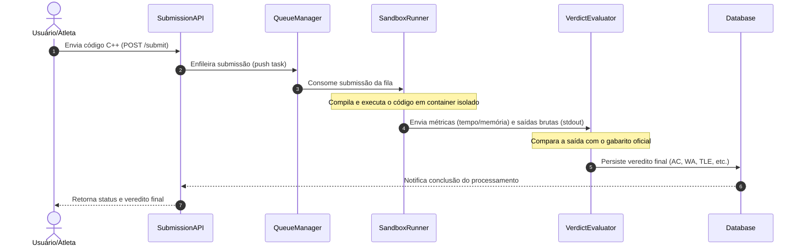

# 02. Testes de Integração (Integration Testing)

Os testes de integração verificam a comunicação e o fluxo de dados entre os diferentes módulos do Julgador Automático.

---

## 2.1 Integração Não Incremental (Big Bang)

### 1. Diagrama de Sequência UML

* **Contexto:** Na abordagem Big Bang, todos os subsistemas do Julgador Automático (`SubmissionAPI`, `QueueManager`, `SandboxRunner`, `VerdictEvaluator` e `Database`) são acoplados e testados simultaneamente de ponta a ponta, sem a criação prévia de *stubs* ou *drivers* para isolamento.

* **Como a abordagem é aplicada:**
  * Uma requisição HTTP simulando o envio de um arquivo C++ é disparada na `SubmissionAPI`.
  * A API repassa a tarefa diretamente para o `QueueManager`, que avisa o `SandboxRunner`.
  * O `SandboxRunner` executa o binário em ambiente isolado e envia as métricas de tempo/memória junto ao `stdout` para o `VerdictEvaluator`.
  * O resultado é gravado no `Database` e retornado ao usuário.

* **Objetivo do Teste e Defeitos Revelados:**
  * **Objetivo:** Validar o fluxo completo da aplicação em um único ciclo e verificar a aderência dos módulos aos contratos de interface.
  * **Incompatibilidades de Payload/Tipagem:** Detecta divergências de formato de dados trafegados entre serviços (ex: IDs passados como `string` pela API e esperados como `integer` pela fila).
  * **Dessincronização de Timeouts:** Revela se o tempo de resposta e retenção da mensagem no `QueueManager` é incompatível com o tempo de compilação/execução no `SandboxRunner`.
  * **Dificuldade de Isolamento:** Demonstra a principal limitação da abordagem: caso ocorra um erro genérico durante o teste, é complexo rastrear se a falha se deu no transporte de dados, na execução do sandbox ou no banco de dados.
