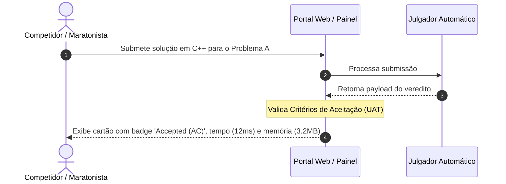
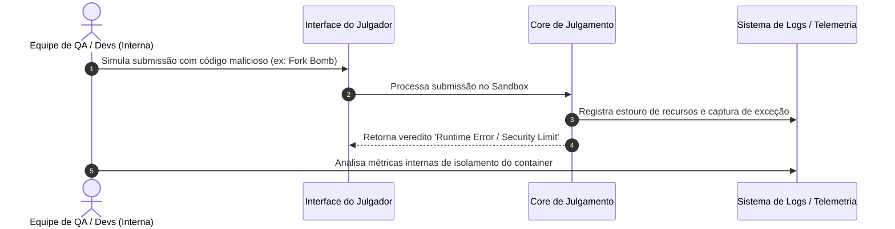
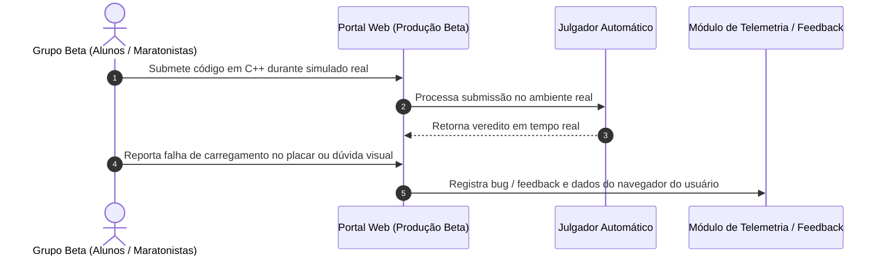

# 03. Testes de Validação (Validation Testing)

Os testes de validação garantem que o Julgador Automático atende às expectativas e aos requisitos de negócio dos usuários finais (competidores, professores e organizadores de maratonas de programação).

---

## 3.1 Critérios de Aceitação (User Acceptance Testing - UAT)

### 1. Diagrama de Sequência UML

### 2. Explicação Textual do Cenário

* **Contexto:** Os Testes de Aceitação do Usuário (UAT) avaliam se o sistema funciona em conformidade com as Histórias de Usuário e regras de negócio especificadas antes do lançamento oficial. O foco sai da arquitetura de código e passa para a experiência e necessidade do maratonista de programação.

* **Como a abordagem é aplicada:**
  * Define-se um conjunto de cenários BDD/Gherkin baseados nos requisitos do produto (ex: *"Dado que o competidor envia um código correto, Quando o julgamento finalizar, Então o sistema deve exibir o badge 'Accepted' verde em até 5 segundos no painel"*).
  * Um usuário de teste (or analista de QA) realiza a submissão através da interface do portal web e inspeciona se o feedback visual exibe detalhadamente a contagem do tempo de execução em milissegundos e o consumo de memória em quilobytes, conforme prometido no contrato de requisitos.

* **Objetivo do Teste e Defeitos Revelados:**
  * **Objetivo:** Confirmar se o software constrói a solução certa para as necessidades reais do usuário final.
  * **Incoerências na Apresentação de Resultados:** Revela se a interface do usuário falha em omitir detalhes confidenciais (ex: exibir o caso de teste fechado do gabarito para o aluno durante a prova, violando as regras da competição).
  * **Falta de Requisitos Funcionais Não Implementados:** Identifica se funcionalidades essenciais para o usuário, como a exportação do histórico de submissões em PDF ou a paginação do placar (*placar/scoreboard*), não foram entregues conforme a especificação de negócio.
 
## 3.2 Teste Alfa (Alpha Testing)

### 1. Diagrama de Sequência UML

### 2. Explicação Textual do Cenário

* **Contexto:** O Teste Alfa é realizado pela própria equipe interna de desenvolvimento e garantia de qualidade (QA) em um ambiente de homologação controlled, imediatamente antes do lançamento de uma versão pública. Ele avalia a estabilidade do Julgador Automático submetendo cenários de uso reais e extremos.

* **Como a abordagem é aplicada:**
  * Os analistas de QA assumem o papel de competidores e "tentam quebrar" o sistema intencionalmente.
  * São submetidos códigos em C++ com comportamento malicioso (como chamadas de sistema proibidas, vazamentos intencionais de memória ou loops infinitos com alta concorrência).
  * A equipe monitora a telemetria, logs de execução e métricas de isolamento do container em tempo real para verificar a resiliência da infraestrutura.

* **Objetivo do Teste e Defeitos Revelados:**
  * **Objetivo:** Descobrir e corrigir bugs críticos de usabilidade, regra de negócio e estabilidade interna antes do sistema ser exposto aos usuários finais.
  * **Vulnerabilidades de Isolamento:** Detecta se scripts em C++ conseguem acessar arquivos do sistema operacional hospedeiro fora da pasta do *Sandbox*.
  * **Comportamento Inesperado sob Erros de Runtime:** Revela se mensagens de erro brutas do compilador (*stack traces*) vazam na interface do usuário, expondo detalhes da arquitetura interna.

## 3.3 Teste Beta (Beta Testing)

### 1. Diagrama de Sequência UML

### 2. Explicação Textual do Cenário

* **Contexto:** O Teste Beta ocorre quando a versão pré-lançamento do Julgador Automático é distribuída para um grupo restrito de usuários finais reais (alunos e competidores de maratona). O sistema é implantado em ambiente real e utilizado de forma orgânica, sem intervenção direta ou supervisão contínua da equipe de desenvolvimento.

* **Como a abordagem é aplicada:**
  * O grupo de testes beta utiliza o julgador para resolver listas de exercícios ou participar de simulados curtos.
  * O sistema coleta métricas de uso não estruturadas, relatórios automáticos de erro (*crash reports*) e *feedbacks* diretos enviados pelos competidores através da interface do portal.
  * A equipe analisa o comportamento do sistema sob condições imprevisíveis de uso do usuário real antes de realizar a liberação geral (GA - *General Availability*).

* **Objetivo do Teste e Defeitos Revelados:**
  * **Objetivo:** Descobrir incompatibilidades e falhas de usabilidade que só se manifestam em cenários heterogêneos de uso real.
  * **Incompatibilidades de Ambiente do Cliente:** Revela problemas de renderização do painel de submissões em diferentes navegadores, dispositivos móveis ou resoluções de tela.
  * **Problemas de Usabilidade sob Estresse de Prova:** Identifica falhas como clareza insuficiente nas mensagens de erro mostradas aos competidores durante a competição ou lentidão percebida ao atualizar a tabela de classificação (*scoreboard*).
