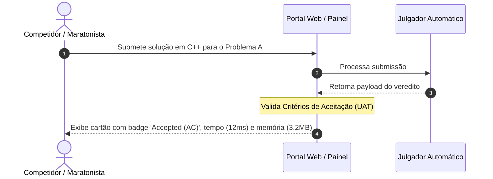

# 03. Testes de Validação (Validation Testing)

Os testes de validação garantem que o Julgador Automático atende às expectativas e aos requisitos de negócio dos usuários finais (competidores, professores e organizadores de maratonas de programação).

---

## 3.1 Critérios de Aceitação (User Acceptance Testing - UAT)

### 1. Diagrama de Sequência UML

### 2. Explicação Textual do Cenário

* **Contexto:** Os Testes de Aceitação do Usuário (UAT) avaliam se o sistema funciona em conformidade com as Histórias de Usuário e regras de negócio especificadas antes do lançamento oficial. O foco sai da arquitetura de código e passa para a experiência e necessidade do maratonista de programação.

* **Como a abordagem é aplicada:**
  * Define-se um conjunto de cenários BDD/Gherkin baseados nos requisitos do produto (ex: *"Dado que o competidor envia um código correto, Quando o julgamento finalizar, Então o sistema deve exibir o badge 'Accepted' verde em até 5 segundos no painel"*).
  * Um usuário de teste (or analista de QA) realiza a submissão através da interface do portal web e inspeciona se o feedback visual exibe detalhadamente a contagem do tempo de execução em milissegundos e o consumo de memória em quilobytes, conforme prometido no contrato de requisitos.

* **Objetivo do Teste e Defeitos Revelados:**
  * **Objetivo:** Confirmar se o software constrói a solução certa para as necessidades reais do usuário final.
  * **Incoerências na Apresentação de Resultados:** Revela se a interface do usuário falha em omitir detalhes confidenciais (ex: exibir o caso de teste fechado do gabarito para o aluno durante a prova, violando as regras da competição).
  * **Falta de Requisitos Funcionais Não Implementados:** Identifica se funcionalidades essenciais para o usuário, como a exportação do histórico de submissões em PDF ou a paginação do placar (*placar/scoreboard*), não foram entregues conforme a especificação de negócio.
