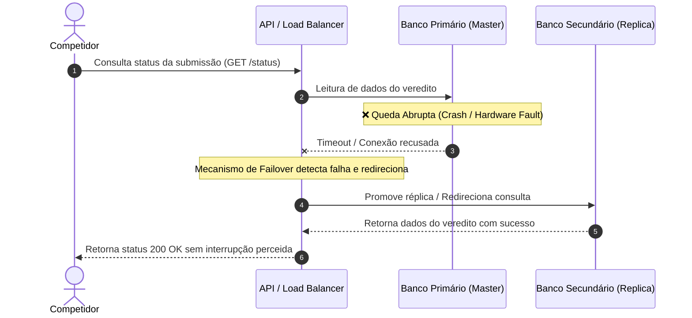

# 04. Testes de Sistema (System Testing)

Os testes de sistema avaliam a solução completa e integrada sob requisitos não funcionais rigorosos de infraestrutura, resiliência, segurança e alto desempenho.

---

## 4.1 Teste de Recuperação (Recovery Testing)

### 1. Diagrama de Sequência UML

### 2. Explicação Textual do Cenário

* **Contexto:** O Teste de Recuperação avalia a capacidade do Julgador Automático de tolerar falhas físicas ou de software severas em ambiente de produção, garantindo que o sistema restabeleça sua operação normal e mantenha a integridade dos dados sem impacto perceptível ao usuário final.

* **Como a abordagem é aplicada:**
  * Durante uma bateria ativa de julgamento de submissões, força-se uma falha crítica de infraestrutura (como a interrupção abrupta do contêiner do banco de dados primário ou o encerramento do processo do servidor).
  * O mecanismo de monitoramento e *failover* (balanceador de carga / orquestrador de contêineres) deve detectar a perda de conectividade com o nó primário e reorientar o tráfego em milissegundos para um nó secundário/réplica.
  * O teste checa se as requisições dos competidores continuam sendo atendidas e se submissões em andamento não foram corrompidas ou perdidas na transição.

* **Objetivo do Teste e Defeitos Revelados:**
  * **Objetivo:** Verificar o RTO (*Recovery Time Objective*) e o RPO (*Recovery Point Objective*) do sistema diante de falhas de hardware e rede.
  * **Incapacidade de Failover Automático:** Revela se a perda do nó primário trava toda a API do julgador exigindo intervenção manual da equipe de infraestrutura.
  * **Inconsistência de Estado/Perda de Dados:** Detecta se submissões processadas imediatamente antes da queda sumiram da base de dados ou ficaram presas em estado indeterminado (ex: mantidas como "Em Processamento" indefinidamente).
 
  * 
